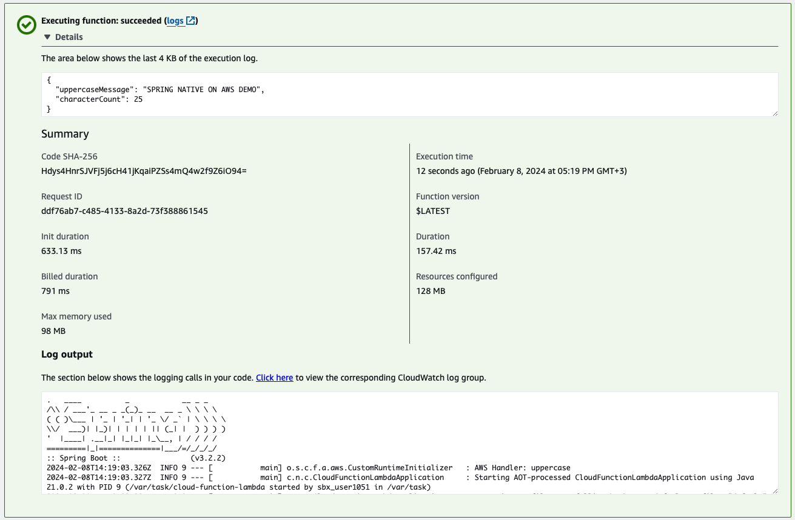
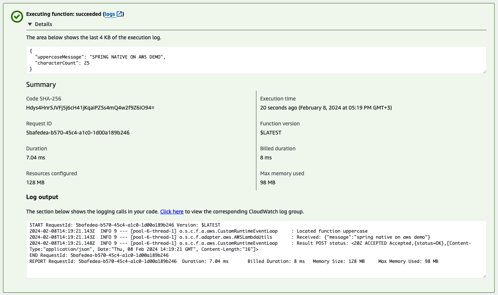

### Build Options
1. Lokaldeki amazonlinux2 container ı ile beraber mvnw build çalıştırılacak.

> [!IMPORTANT]
> Bu .zip dosyasının projedeki target alanına düşmesi gerekiyor.

> [!NOTE]
> Bu .zip dosyası daha sonra el ile aws konsolda import edilebilir.

```
docker build -f Dockerfile -t cloud-function-lambda:native.0.0.1:SNAPSHOT .
```

2. SAM Build & Deploy

```
./aws-image/build-aws-image.sh
```

```
sam build --use-container --build-image amazonlinux-graalvm-builder:latest 
```

```
set AWS_REGION=eu-central-1
sam deploy --region $AWS_REGION --guided
```

### Benchmarks

#### Cold Start



#### Warm Start



### References

https://github.com/neil-writes-code/spring-native-aws-demo/tree/main/cloud-function-lambda

https://neilwhite.ca/spring-native-aws-lambda-part-2-the-build/

https://aregall.tech/aws-lambda-spring-cloud-function-kotlin-graalvm-native-openai