## Concept

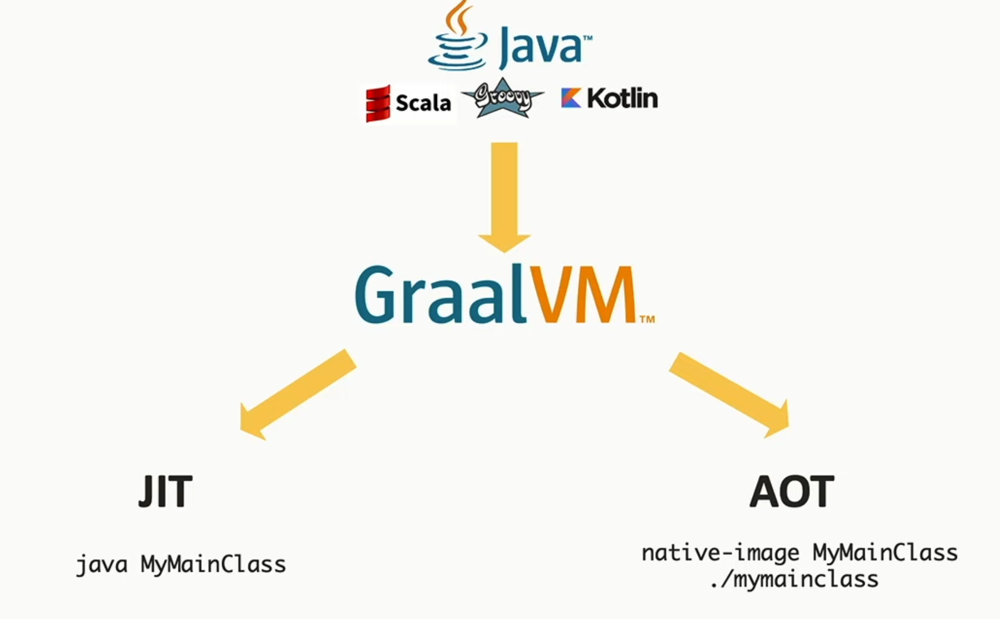

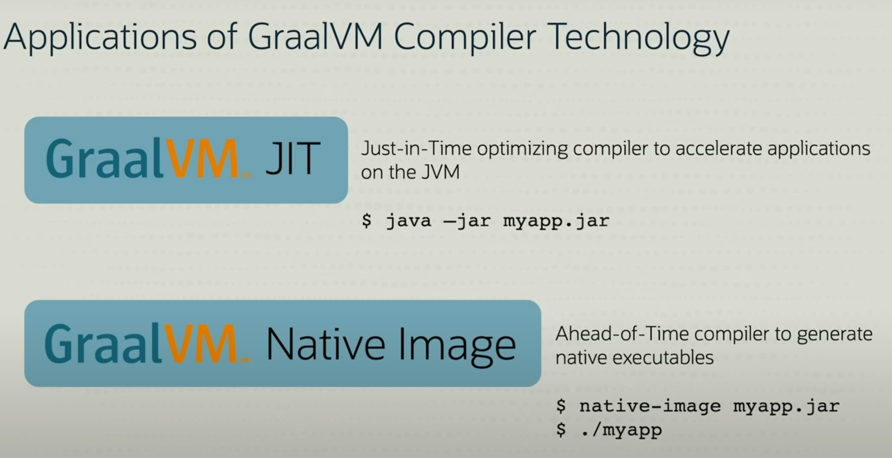
## Advantages

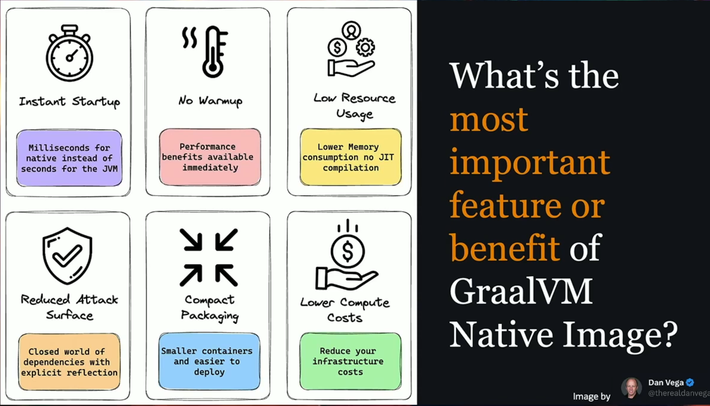

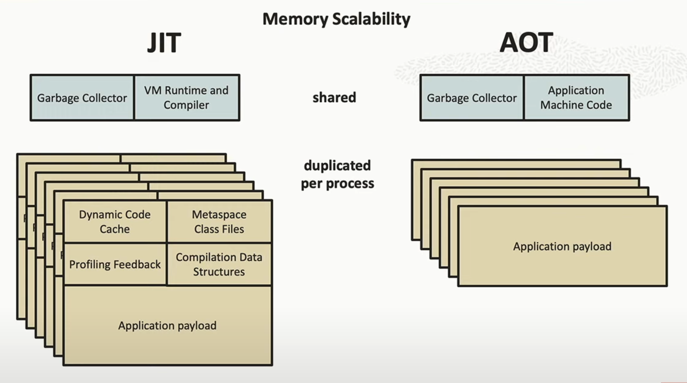

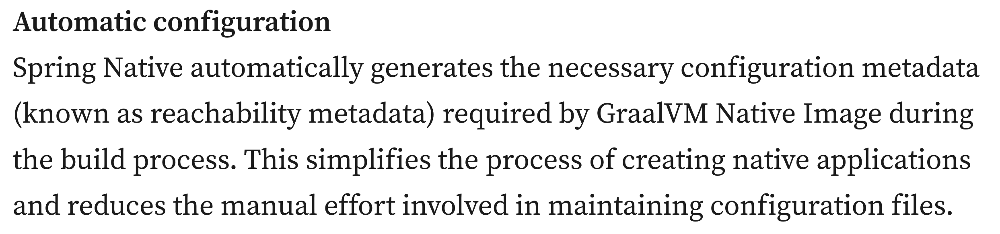
## Disadvantages

- Due to the nature of AoT, features that rely on dynamic class loading, proxies, or reflections need to be known at build time and require special support. (Can be automatically generated via Tracing agent)
- JNI
- Serialization
- Slow build time
- Needs additional powerful "build machine" with same architecture as production machine❗
- Needs additional "test machine" with the same architecture as production machine

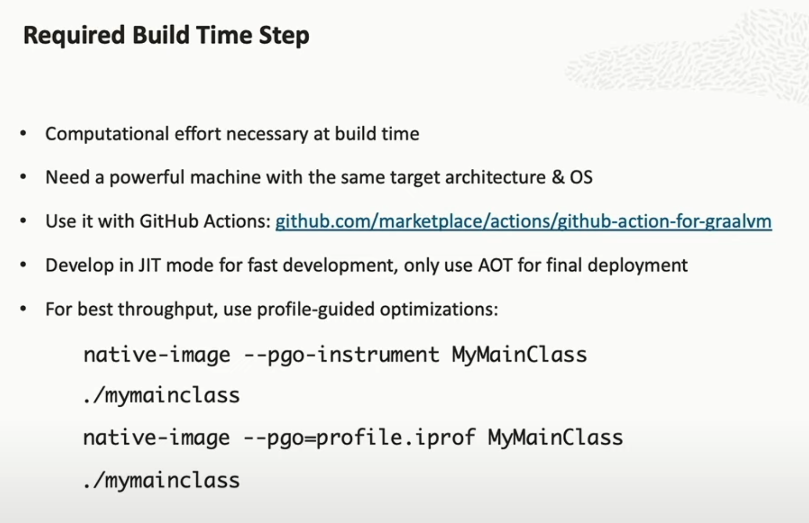

|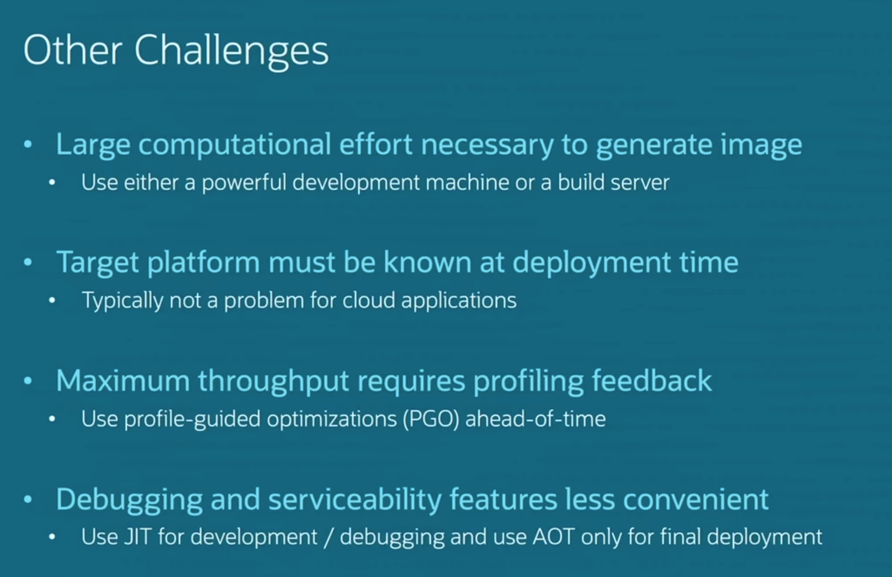|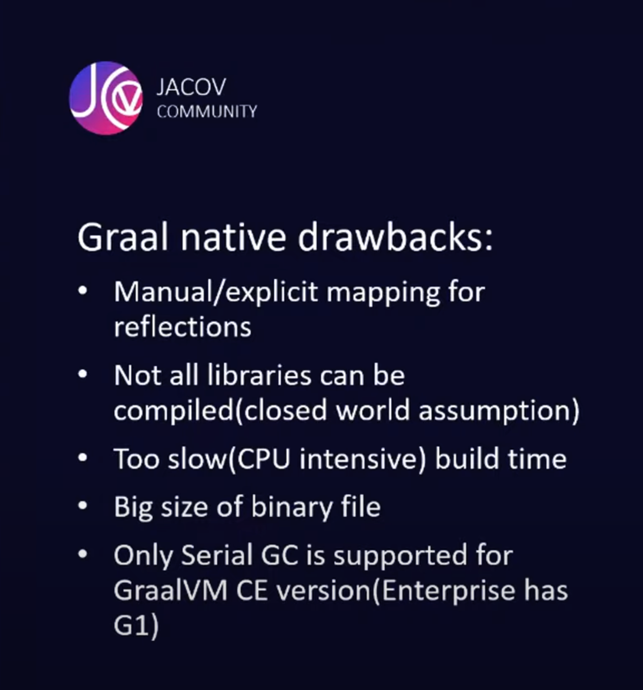
|-|-

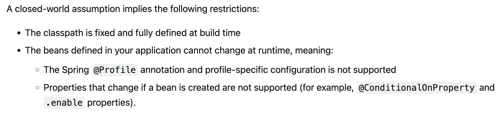

> [!TIP]
> Development in JIT mode, deployment as native image
#### GraalVM On AWS Lambda

[AWS-Snapstart](docs/AWS-Snapstart.md) as an option.

> [!TIP]
> graalvm + aws lambda
> It is good for small services but if big services are necessary with many dependencies (reflection etc.) then it might be a problem
## Benchmarks

> [!IMPORTANT]
> PGO is not available in GraalVM Community Edition.

[local-machine-arm-m1](benchmarks/local-machine-arm-m1.md)
## Testing And Debugging

## Logging

## Monitoring

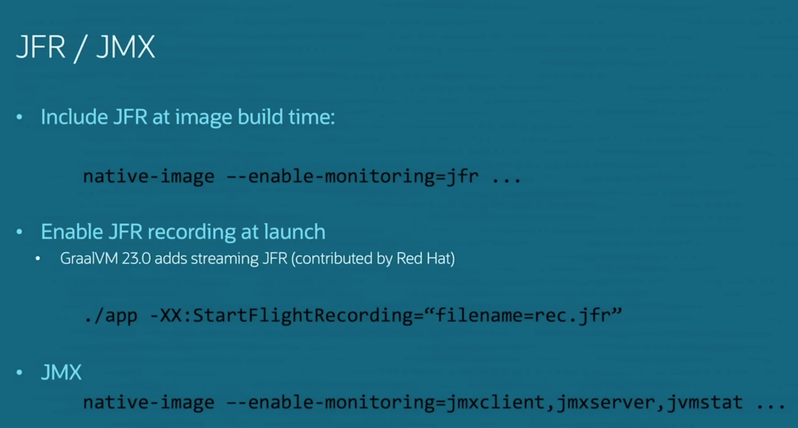

## Licensing

https://www.oracle.com/java/technologies/javase/jdk-faqs.html#GraalVM-licensing

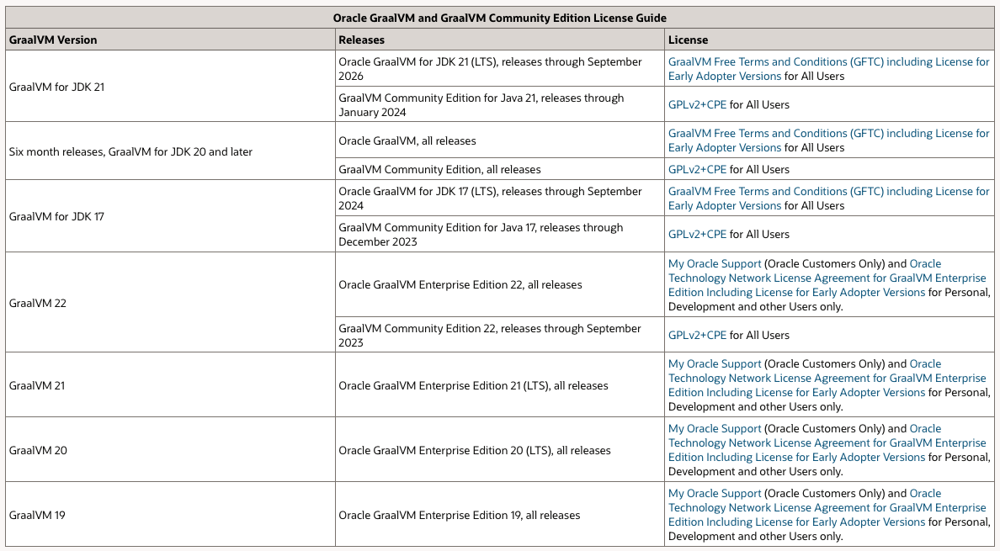

> [!NOTE]
> Oracle GraalVM was formerly known as GraalVM EE

> [!NOTE]
> We are introducing a new distribution — Oracle GraalVM. It is available for JDK 17 and JDK 20 and released under the GraalVM Free Terms and Conditions (GFTC) license (also see the FAQ). This means that you can use all the greatest GraalVM features, both for development and in production, for free!
> 
> https://medium.com/graalvm/a-new-graalvm-release-and-new-free-license-4aab483692f5#a7f7

## Support & Ecosystem

### Supported Frameworks
 - Spring
 - Quarkus
 - Micronaut

> [!NOTE]
> With Spring Boot 3 and Spring 6 (due to be released November 24, 2022), support for native image will be available as a core feature.
## Compatibility

https://www.graalvm.org/native-image/libraries-and-frameworks/

https://github.com/oracle/graalvm-reachability-metadata/blob/master/library-and-framework-list.json

https://www.graalvm.org/latest/reference-manual/native-image/metadata/Compatibility/

https://github.com/spring-projects/spring-boot/wiki/Spring-Boot-with-GraalVM

---
## References

https://www.graalvm.org/latest/docs/

https://docs.spring.io/spring-boot/docs/3.0.0/reference/html/native-image.html#native-image.introducing-graalvm-native-images

https://medium.com/graalvm/a-new-graalvm-release-and-new-free-license-4aab483692f5#a7f7

https://blogs.oracle.com/java/post/go-native-with-spring-boot-3-and-graalvm

https://github.com/ionutbalosin/jvm-performance-benchmarks

https://github.com/ionutbalosin/faster-jvm-start-up-techniques

https://micronaut.io/2022/11/28/leveraging-aws-lambda-snapstart-with-the-micronaut-framework/

https://graalvm.github.io/native-build-tools/latest/maven-plugin-quickstart.html

https://docs.oracle.com/en/graalvm/jdk/21/docs/reference-manual/native-image/guides/include-resources/#include-resources-in-a-native-executable

https://www.youtube.com/watch?v=sI-zXYLKzfk&list=PLtobYLL_FiM4PVMEtCraLJyeH2mBgAOVW&index=8&ab_channel=Java

https://www.youtube.com/watch?v=SXNf_0yQk7k&list=PLtobYLL_FiM4PVMEtCraLJyeH2mBgAOVW&index=14&ab_channel=JACOV
## Useful Links

https://github.com/graalvm

https://github.com/graalvm/graalvm-demos/tree/master

https://github.com/orgs/oracle/projects/6/views/1

https://ionutbalosin.com/2023/03/jvm-performance-comparison-for-jdk-17/

https://softwaremill.com/how-to-migrate-a-spring-boot-app-to-a-native-image/