### Time to First Response

|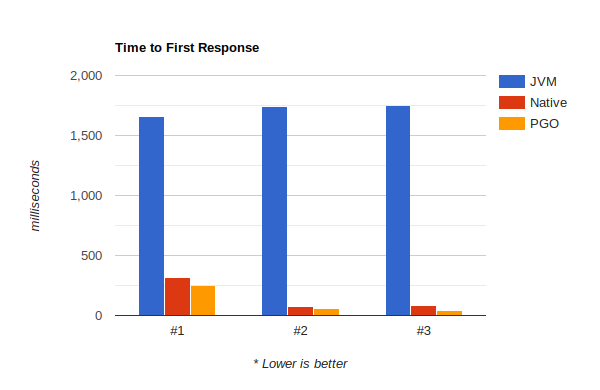|
|-|-

### Throughput

|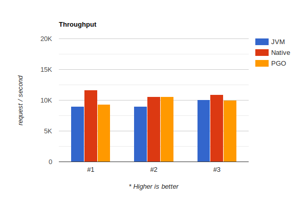|
|-|-

### Resource Consumption

| **JVM #1** | **Native #1** | **PGO #1** |
| ---- | ---- | ---- |
| 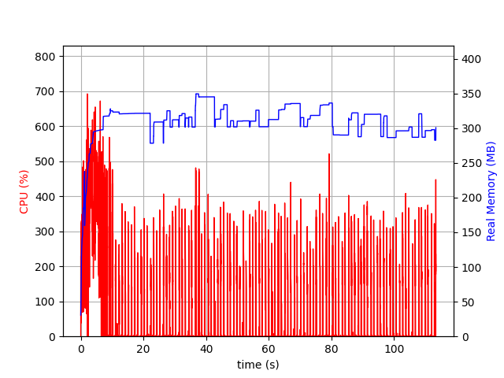 | 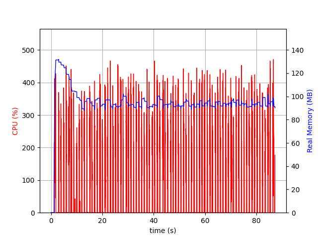 | 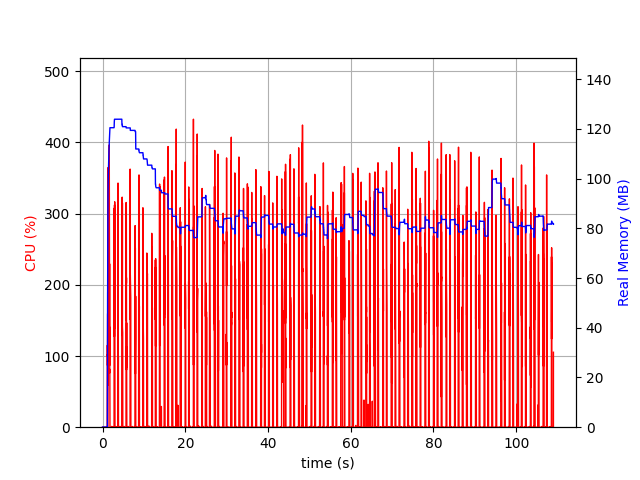 |
| **JVM #2** | **Native #2** | **PGO #2** |
| 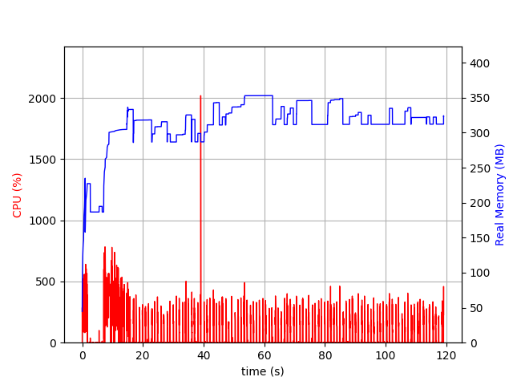 | 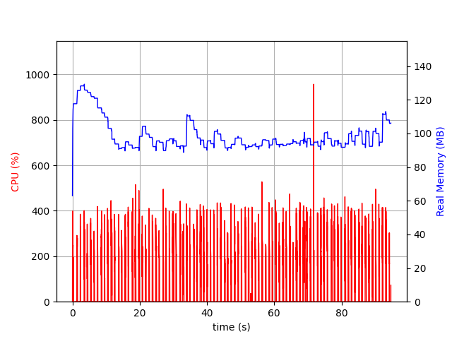 | 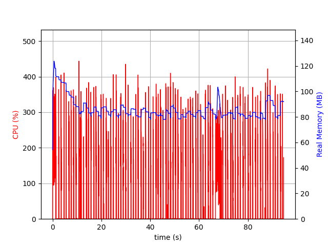 |
| **JVM #3** | **Native #3** | **PGO #3** |
| 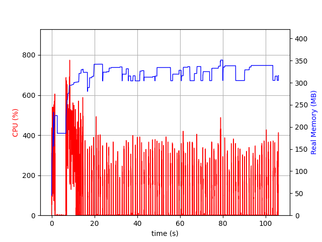 | 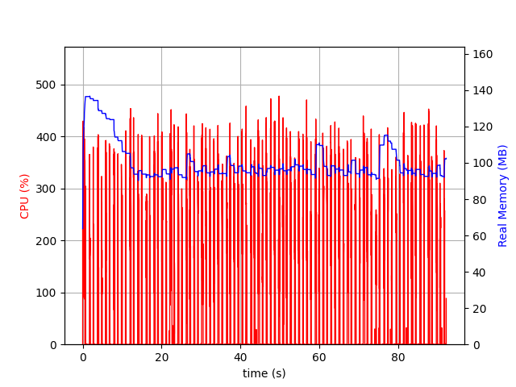 | 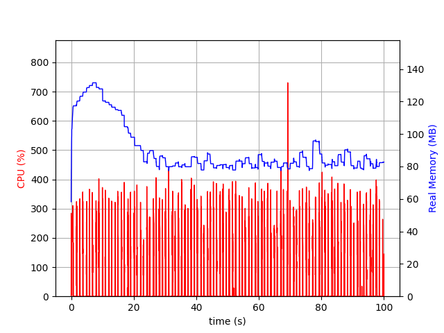 |

### Build Time

|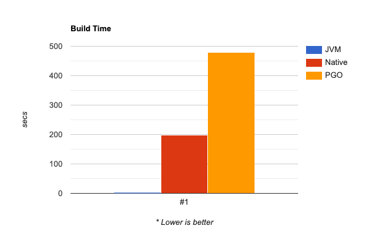|
|-|-

### File Size

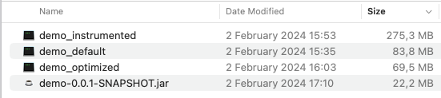