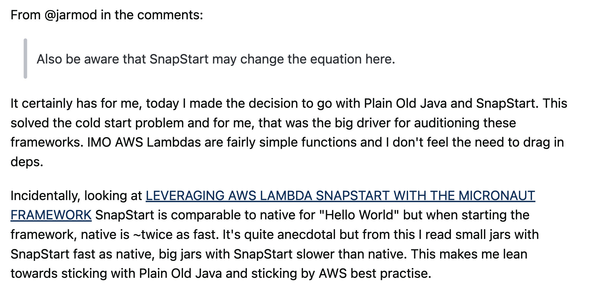

1. The largest contributor to startup latency is the time that Lambda spends initializing the function. With SnapStart, Lambda initializes your function when you publish a function version. 
2. AWS Lambda takes a Firecracker microVM snapshot of the memory and disk state of the initialized execution environment, encrypts the snapshot, and caches it for low-latency access. 
3. After you invoke the function version for the first time, and as the invocations scale up, Lambda resumes new execution environments from the cached snapshot instead of initializing them from scratch. This improves startup latency. 
4. If your applications depend on the uniqueness of state, then you must evaluate your function code and verify that it is resilient to snapshot operations. 
5. As of this recording, SnapStart supports the Java 11 and Java 17 managed runtimes. Other managed runtimes, custom runtimes, and container images are not supported. 
6. SnapStart does not support provisioned concurrency, the arm64 architecture, Amazon EFS, or ephemeral storage greater than 512 MB. 
7. SnapStart works best when used with function invocations at scale. Functions that are invoked infrequently might not experience the same performance improvements. In summary, AWS Lambda SnapStart is a performance optimization that makes it easier for you to build highly responsive and scalable Java applications using Lambda.

## Reference

https://www.youtube.com/watch?v=QhVUUxDU13I&ab_channel=GokceDB